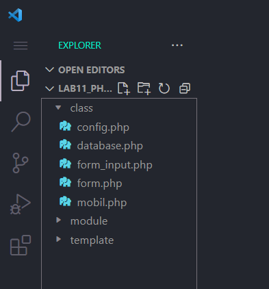
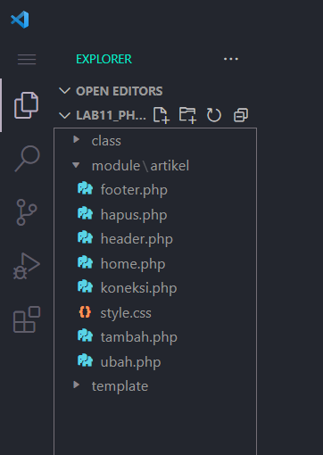
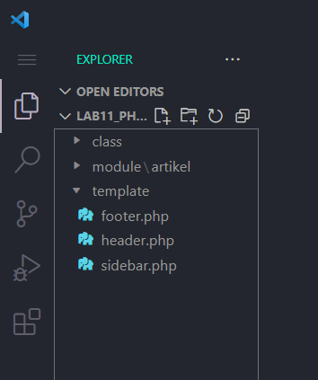

# Tugas Praktikum { Pertemuan ke 13 } 

|**Nama**|**NIM**|**Kelas**|**Matkul**|
|----|---|-----|------|
|Muhammad Ikhsan Fakhrudin|312210019|TI.22.A.2|Pemrograman Web 1|

# PHP OOP Lanjutan

## Langkah-Langkah Praktikum

Membuka ``text editor`` , di sini saya menggunakan ***Visual Studio Code.***

## Start Apache dan MySQL server dari menu XAMPP Control

## 1. Membuat Folder 'class'

Folder 'class' berisi file ``config.php``, ``database.php``, ``form_input.php``, ``form.php``, ``mobil.php.``

## 2. Membuat Folder 'module'

Didalam Folder 'module' terdapat sebuah folder lagi yg bernama 'artikel' yang berisi file ``home.php``, ``tambah.php``, ``ubah.php`` dll ....

## 3. Membuat Folder 'template'

Folder 'template' berisi file ``header.php``, ``footer.php``, ``sidebar.php.``

## 4. Copy File Library (class) dari Praktikum 10 dan Letakkan Pada Folder 'class'

File library (class) yang dimaksud adalah file ``database.php`` dan ``form.php`` dari **praktikum 10.** File-file tersebut berisi kelas Database dan Form yang akan digunakan dalam praktikum ini.

***Library*** adalah kumpulan kode yang dapat digunakan kembali untuk berbagai keperluan. Dalam praktikum ini, library yang digunakan adalah library database dan form. Library database menyediakan fungsi-fungsi untuk mengakses database, sedangkan library form menyediakan fungsi-fungsi untuk membuat dan memproses form.

***CRUD*** adalah singkatan dari Create, Read, Update, Delete. CRUD merupakan operasi dasar yang dapat dilakukan pada data dalam database. Dalam praktikum ini, modul artikel akan menerapkan operasi CRUD untuk mengelola data barang.

## SELESAI  